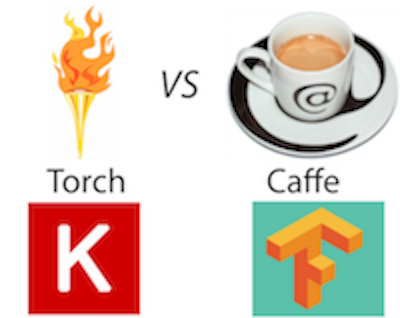
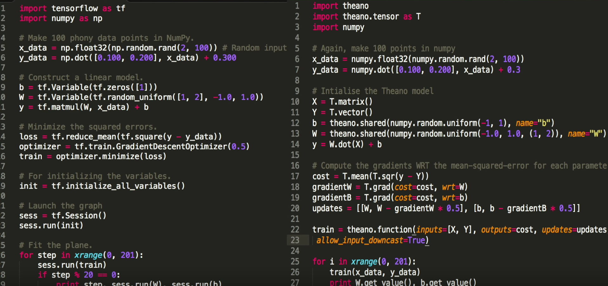

# Deep Learning Frameworks Comparison

## Existing frameworks

A more thorough evaluation can be found here: https://github.com/zer0n/deepframeworks

1. Sci-kit Learn
2. Caffe
3. Theano
4. Tensorflow

### sklearn

* Simple, easy to use off-the-shelf ML algorithms
* No neural network support
* No GPU support

### Caffe

* One of the first mainstream deep learning frameworks
* Most popular deep learning architectures use Caffe for benchmark
* Not very flexible (protobuf/config text files)
* Command line/Python to train

#### Examples

MNIST simple classifier: https://github.com/BVLC/caffe/tree/master/examples/mnist

#### Model Zoo

Allows to use pre-trained models and existing architectures: https://github.com/BVLC/caffe/wiki/Model-Zoo

AlexNet example: https://gist.github.com/kevinlin311tw/a0a36e2b4d6ab9b09201

### Theano

* Windows support
* Developed by University of Montreal
* Similar, but more verbose than Tensorflow
* No built-in tools for optimizers

### Tensorflow

* Implements all general-purpose algorithms from sklearn
* Faster training time than Caffe: http://add-for.com/deep-learning-benchmarks/caffe-vs-tensorflow
* Developed by Google

#### Models

Similar to Caffe's Model Zoo's, it is possible to find existing pre-trained model's out of the box: https://github.com/tensorflow/models

Caffe models have also been ported to Tensorflow:
https://github.com/ethereon/caffe-tensorflow

### Keras

An even simpler way to code AlexNet: https://gist.github.com/JBed/c2fb3ce8ed299f197eff#file-gistfile1-py
